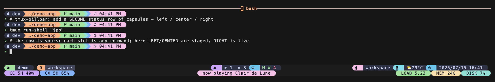

# tmux-pillbar（繁體中文說明）

> 完整英文文件見 [README.md](../README.md)

**在 tmux 狀態列下面再開一列，分成左／中／右三個槽，用「膠囊」樣式呈現的組裝框架。**
你把任意指令或 tmux 變數塞進三個槽，其餘的排版由它處理。



*三個槽——`left`·`centre`·`right`——變成第二列狀態列上的三顆膠囊。內容和顏色由你決定，pillbar 只負責把這一列排好。*

pillbar 是**框架，不是主題**。它**不內建任何配色**、**不內建任何內容**——顏色和指令都由你決定。
它天生和 `tmux-sysmon`、`tmux-agent-status`、`tmux-llm-usage` 這類內容提供者互補（下面有三件套範例）。

> **範圍（v0.1 刻意設計）**：pillbar 只碰**第二列**（`status-format[1]`），
> 完全不動 row 0、`status-left`、`status-right`。所以它不會和你現有的狀態列或主題打架，
> 也不會因為 tmux 改了預設格式字串而壞掉。你的第一列維持原樣。

> **平台**：框架本身是純 tmux，**Linux 和 macOS 都能跑**。唯一內建的**範例**提供者
> `nowplaying-demo.sh` 只支援 macOS，在其他平台上輸出空字串。

---

## 1. 這是什麼？

tmux 狀態列只有一行。有時你想要第二行放「環境資訊」——系統負載、正在播的歌、
LLM 用量——又不想把它們全擠進第一行。

pillbar 給你這第二行，切成**三個槽**：左、中、右。你決定每個槽放什麼，
pillbar 負責把每個槽固定在左／中／右，並在文字外面加上（可選的）膠囊外框。
它**不決定你的顏色**——框架不該管這個。

---

## 2. 快速上手

需要 **tmux 2.9 以上**（用 `tmux -V` 確認）。下面兩條路擇一。
全文的 **`prefix`** 指你的 tmux 前綴鍵——沒改過的話就是 **`Ctrl-b`**。

預設情況下，任何一個槽都沒填時第二列不會出現，所以範例先在中槽放一個時鐘讓你看得到效果。

### 路徑 A — 沒用外掛管理器（現在就能動）

```sh
# 1. 把外掛下載到固定位置
git clone https://github.com/operonlab/tmux-pillbar ~/.tmux/plugins/tmux-pillbar

# 2. 叫 tmux 載入它，並給中槽放個時鐘
cat >> ~/.tmux.conf <<'CONF'
set -g @pillbar-center '#(date +%H:%M)'
run-shell ~/.tmux/plugins/tmux-pillbar/pillbar.tmux
CONF

# 3. 重新載入設定（在 tmux 裡按 prefix 再按 r，或執行這行）
tmux source-file ~/.tmux.conf
```

第二列出現，中間有個時鐘。完成。

### 路徑 B — 用 TPM（tmux 外掛管理器）

還沒裝 TPM 就先裝：

```sh
git clone https://github.com/tmux-plugins/tpm ~/.tmux/plugins/tpm
```

確認 `~/.tmux.conf` 最後一行是 `run '~/.tmux/plugins/tpm/tpm'`，
然後在那行**上面**加：

```tmux
set -g @plugin 'operonlab/tmux-pillbar'
set -g @pillbar-center '#(date +%H:%M)'
```

重新載入（`prefix` `r`），再按 `prefix` `I`（大寫 i）讓 TPM 下載。第二列就出現了。

---

## 3. 填槽（這是核心）

> ⚠️ **`@pillbar-left`、`@pillbar-center`、`@pillbar-right` 會執行程式。**
> `#(...)` 裡的東西每次狀態列刷新都會被你的 shell 執行。
> 這幾個選項**只在你信任的 tmux.conf 裡設定**——和你對待 `status-left` 的態度完全一樣。

槽的值會**原封不動**放進 tmux 的狀態格式，所以用一般的 tmux 語法：

| 你想要 | 槽裡放 |
|---|---|
| 指令的輸出 | `#(某個指令 --參數)` |
| tmux 變數 | `#{pane_current_path}` 或 `#S` |
| 純文字 | `on air` |
| 什麼都不要（該槽消失） | 留空 |

### ⚠️ 唯一的地雷：槽裡絕不能出現 `#[align=...]`

pillbar 把 `#[align=left]` / `#[align=centre]` / `#[align=right]` 三個標籤
**靜態**寫進格式字串。**槽的動態 `#(...)` 輸出絕對不能包含 `#[align=...]` 標籤。**
一旦 align 從 `#()` 回傳出來，tmux 的排版引擎會**卡在 100% CPU** 永遠重算版面。
顏色（`#[fg=...]`、`#[bg=...]`）放在槽輸出裡完全沒問題——只有對齊是禁區。
內建的 `pill.sh` 遵守這條；你自己寫提供者也要把 `align` 排除在輸出之外。

### 用 `pill.sh` 做膠囊

`scripts/pill.sh` 把簡單的資料行變成膠囊。用 stdin 餵它 `icon|label|value|fg|bg` 格式：

```tmux
set -g @pillbar-right '#(printf "%s\n" "|CPU|12%|colour15|colour24" | ~/.tmux/plugins/tmux-pillbar/scripts/pill.sh)'
```

空欄位會被略過；`fg`／`bg` 不填時用終端機自己的顏色。外觀由 `@pillbar-pill-style` 控制（見下方選項）。
最乾淨的用法是從一個小的**提供者腳本**呼叫它（在腳本檔裡 `%` 和 `printf` 都正常）。
`examples/nowplaying-demo.sh` 就是一個用了 `pill.sh` 的完整提供者。

### 關於 `%`（百分比符號）

tmux 會把 `#( ... )` **裡面**的字先當成格式字串解析，`%` 在那裡是特殊字元（`%s` 會變時間戳、單獨的 `%` 會消失）。兩個後果：

- **直接寫在 tmux.conf 裡的 `#()` 指令**：字面的百分比要寫兩個，`#(echo "42%%")` 才會顯示 `42%`。所以建議把指令放進**腳本檔**——腳本裡的 `%` 是普通字元。
- **提供者的輸出**：`%` 不特殊——tmux 不會再展開指令印出來的東西。所以提供者（或 `pill.sh`）印 `42%` 就顯示 `42%`，輸出裡永遠不用把 `%` 加倍。

### 非阻塞規則（慢的東西尤其重要）

`#(...)` 裡的東西都跑在 tmux 刷新的主迴圈上。**一個每次刷新都連網（或做任何慢事）的槽會讓 tmux 卡頓。**
正確做法是：讀快取檔立刻回傳；快取過期時，在**完全脫離的背景工作**裡刷新。
`examples/nowplaying-demo.sh` 就是這個模式的完整範例，也是你自己寫提供者的好模板。

---

## 4. 三件套範例

`examples/family.conf` 把三個互補的提供者接進三個槽：左＝LLM 用量、中＝正在播放（macOS 範例）、右＝系統狀態。
複製那個檔案，把路徑指向你實際有的提供者，重新載入即可。每個提供者都讀自己的快取、不阻塞。

---

## 5. 選項

在載入外掛那行**之前**設定。每個選項都有合理預設，不需要就別動。

| 選項 | 預設 | 說明 |
|---|---|---|
| `@pillbar-left` | _(空)_ | 左槽內容。`#(指令)`、`#{變數}` 或純文字。空＝沒有左槽。**會執行程式，見上方警告。** |
| `@pillbar-center` | _(空)_ | 中槽內容。規則同上。**會執行程式。** |
| `@pillbar-right` | _(空)_ | 右槽內容。規則同上。**會執行程式。** |
| `@pillbar-center-align` | `centre` | 中槽怎麼置中。`centre` 是在左右槽**剩下的空間**裡置中（到處都能用）。`absolute-centre` 是對**整條寬度**置中——見下方說明。 |
| `@pillbar-bg` | `default` | 整條第二列的背景色（膠囊之間的縫）。`default`＝終端機自己的背景。 |
| `@pillbar-pill-style` | `ascii` | `pill.sh` 的膠囊外觀：`ascii`＝`[ ... ]` 方括號（任何字型）；`nerd`＝半圓端蓋（需 Nerd Font）；`none`＝純色文字、無外框。 |

### 關於 `absolute-centre`

`centre`（預設）是安全選擇，任何有第二列的 tmux 都能用。
`absolute-centre` 是**較新**的 tmux 值：它對整條寬度置中，不管左右槽多寬，中間文字都不會被推走。
這是**選用**的：

```tmux
set -g @pillbar-center-align absolute-centre
```

太舊的 tmux 認不得它時，中槽會**塌到左邊**。如果你設了 `absolute-centre` 而中間內容跳到最左邊，
代表你的 tmux 太舊——換回 `centre`（或升級 tmux）。在 `tmux next-3.8` 上實測：
`absolute-centre` 對整條寬度置中、`centre` 在剩餘空間置中、認不得的值會退回靠左。

---

## 6. 移除

在有連線的 tmux client 執行：

```sh
bash ~/.tmux/plugins/tmux-pillbar/scripts/teardown.sh
```

然後從 `~/.tmux.conf` 刪掉載入那行（`run-shell ...pillbar.tmux` 或 `set -g @plugin ...`），
重新載入（`prefix` `r`）。teardown 會把 `status` 還原成 pillbar 第一次載入時存下的原值，
並保留你自己的 `@pillbar-*` 設定行（要清自己手動刪）。

---

## 7. 常見問題

**Q：載入了但第二列沒出現。**
至少要有一個槽有內容才會顯示。設一個，例如 `set -g @pillbar-center '#(date +%H:%M)'`，
重新載入（`prefix` `r`）。再確認 tmux 真的切成兩列：`tmux show-option -gv status` 應該印 `2`。

**Q：加了某個槽之後 tmux 卡在 100% CPU。**
幾乎可以確定是那個槽的 `#(...)` 輸出含了 `#[align=...]` 標籤——這是槽絕不能吐的東西
（見上方「唯一的地雷」）。把那個指令輸出裡的 `align` 拿掉。顏色沒事，對齊不行。

**Q：某個槽更新時整條列會頓一下。**
那個槽直接在 `#(...)` 裡做慢事（連網、開重的程序），擋住了 tmux 刷新。
改用 `examples/nowplaying-demo.sh` 的「快取＋背景刷新」模式：立刻讀快取，背景更新。

**Q：設了 `absolute-centre`，中槽跳到最左邊。**
你的 tmux 認不得 `absolute-centre`。用 `@pillbar-center-align centre`（預設），或升級 tmux。

**Q：`nerd` 樣式的圓角變成豆腐方塊或問號。**
半圓端蓋是 Nerd Font 字元（`E0B6` / `E0B4`），你的終端字型不是 Nerd Font。
改用 `@pillbar-pill-style ascii`（或 `none`），或安裝 Nerd Font。

**Q：這會改到我的第一列嗎？**
不會。pillbar 只寫 `status-format[1]`（第二列）和 `status` 高度。
你的 row 0、`status-left`、`status-right` 依設計完全不動。

---

## 8. 授權

由 [operonlab](https://github.com/operonlab) 製作，採 **MIT License**（見 [LICENSE](../LICENSE)）。
